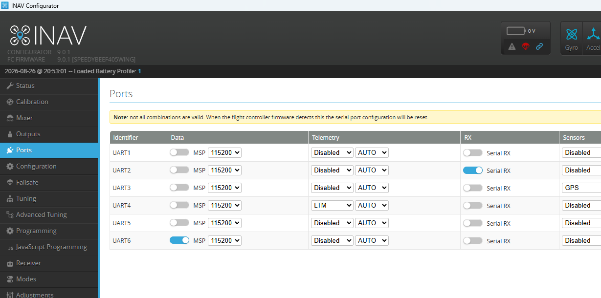

## 2. INAV-EINSTELLUNGEN (FLIGHT CONTROLLER)

Damit Daten aus dem TX4-Pad fließen, müssen im iNav-Configurator folgende Parameter aktiv sein:

1. **Ports-Tab:** Am genutzten Hardware-UART (UART 4) die Option **Telemetry** auf **LTM** stellen (Geschwindigkeit schaltet iNav automatisch fest auf **19200 Baud**).

2. **Configuration-Tab:** Das System-Feature **SOFTSERIAL** muss global **deaktiviert (AUS)** sein, um den stabilen Betrieb über den Hardware-UART zu erzwingen.

