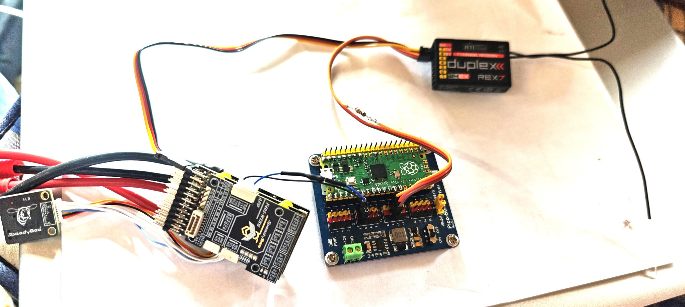
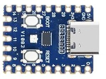

# Universal iNav LTM-zu-Telemetrie Konverter (RP2040)

Die hier vorgestellte Lösung ermöglicht die Übertragung von Telemetriewerten von 
einem INAV Flugcontroller zu Multiplex oder Jeti REX Empfängern.

Hierzu wird ein kleines PICO Board benötigt, das mit einem Widerstand zwischen
dem INAV Port4 und dem Telemetrie-Eingang des Empfängers eingefügt wird.

Die Steurungsdaten vom Rex Empfänger kommen über ein separstes Kabel per SBUS zum
UART2 des Flugkontrollers

Zur Konfiguration des Boards wird dieses mit einem USB Kabel an einem PC angeschlossen.
Es öffnet sich ein Windows-Explorerfenster. In dieses kopiert man die entsprechende 
.uf2 Datei aus dem Ordner Config und das wars!

Also ein sehr überschaubares Projekt!

## Hier der erste Musteraufbau

*Der Konverter auf dem Bild ist ein Musteraufbau, der eigentliche Konverter hat die Größe einer Briefmarke*

[Zum technischen Hintergrung](Doku/Hintergrund.md)

[Zur Lösungsbeschreibung](Doku/Lösung.md)

[Zum physikalischen Aufbau](Doku/Aufbau.md)

[Zur INAV Konfiguration](Doku/INAV.md)

[Zur JETI Konfiguration](Doku/Jeti.md)

[Zum USB MENUE des Konverters](Doku/Konverter.md)

[Zum orginalen OPENXSENSOR on RP2040 Projekt](Doku/oxs.md)

